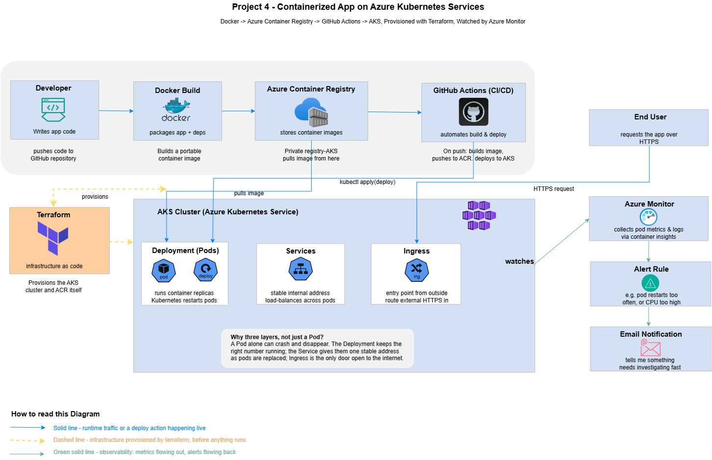
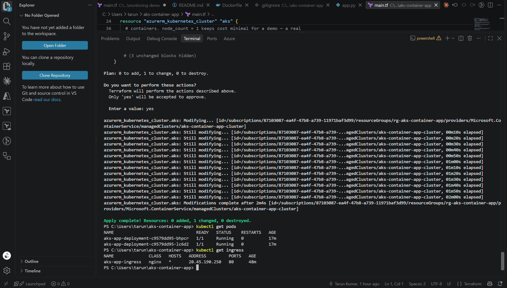
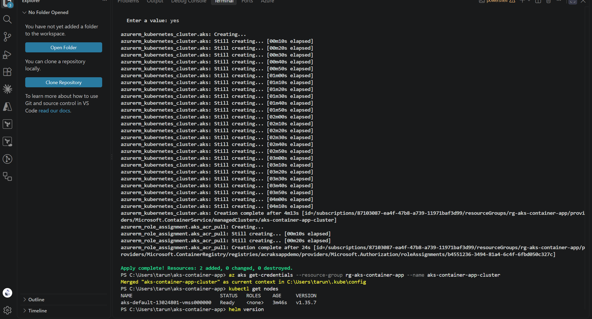
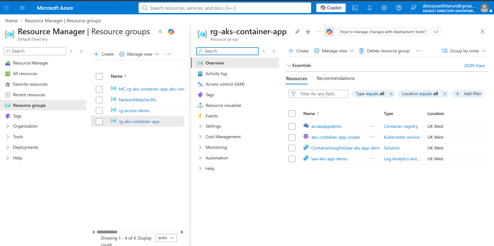
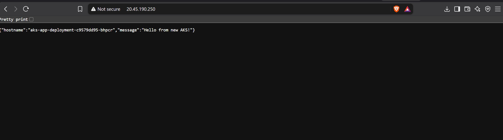
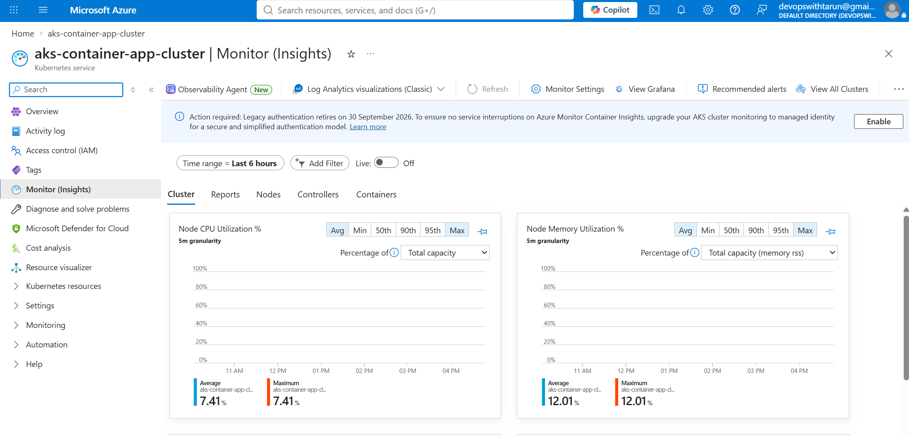
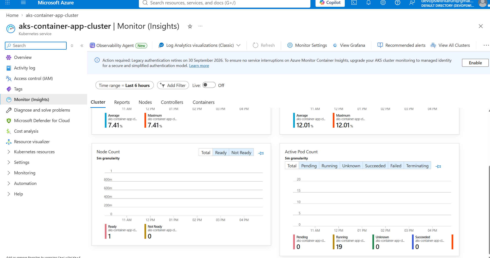
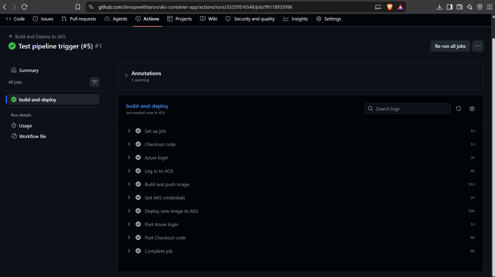

# Containerized App on Azure Kubernetes Service

## Scenario
Built and deployed a containerized Flask application end-to-end on Azure —
from a Dockerfile through to a running Kubernetes cluster with automated
CI/CD and monitoring — combining and extending everything from the first
three projects (Terraform, RBAC, CI/CD, monitoring) with Docker and
Kubernetes on top.

## Architecture

## What I Built
- A minimal Flask API, containerized with Docker
- Azure Container Registry (ACR) to store the image, provisioned via Terraform
- An AKS cluster provisioned via Terraform, with explicit RBAC (`AcrPull`
  role) granting the cluster permission to pull images from ACR
- Kubernetes manifests: a Deployment (2 replicas, with liveness/readiness
  probes and resource limits), a Service, and an Ingress routed through the
  NGINX Ingress Controller
- A GitHub Actions pipeline that builds the image, pushes it to ACR, and
  deploys it to AKS on every push — using `kubectl rollout status` to
  confirm the deploy actually succeeded, not just that it was triggered
- Container Insights (Azure Monitor) wired into the cluster for pod-level
  metrics and logs
- Built entirely through feature branches and pull requests into a
  protected `main` branch — no direct commits to `main` for any code change

## Why AKS, Not a Simpler Option
For a single small app, Azure App Service would genuinely be simpler and
cheaper. AKS was a deliberate choice here to build real Kubernetes
experience — orchestration, self-healing, and load-balancing across
replicas — since that's a skill gap I was specifically closing with this
project, not because this app's scale required it.

## Real Troubleshooting Along the Way
- **AKS ↔ ACR permissions**: pods initially would have failed to pull
  images without an explicit `AcrPull` role assignment between the
  cluster's identity and the registry — RBAC across two services doesn't
  happen automatically, same lesson as Project 1's IAM work, applied here.
- **OIDC issuer conflict**: a later `terraform apply` to add monitoring
  failed with `OIDCIssuerFeatureCannotBeDisabled` — Azure had enabled this
  by default on cluster creation, but it wasn't declared in the Terraform
  config, so Terraform tried to reset it. Fixed by explicitly setting
  `oidc_issuer_enabled = true` to match reality.
- **Ingress needs its own controller**: AKS doesn't ship with an Ingress
  controller by default — had to install NGINX Ingress via Helm before the
  Ingress manifest could route any traffic at all.

## AI-Assisted Development
- Used Claude for Terraform, Kubernetes manifests, and pipeline syntax
- Caught a real mistake myself: an early draft of the monitoring Terraform
  duplicated the AKS cluster as a second, invalid resource block instead of
  adding the monitoring agent inside the existing one — reviewed the code
  before applying and had it corrected before running `terraform apply`

## Proof It Works

## Git Workflow
Every change in this project went through a feature branch and pull request
into a protected `main` branch (required PR, squash-merge only, direct
pushes blocked). Branches used: `feature/dockerfile`,
`feature/acr-terraform`, `feature/aks-cluster`, `feature/cicd-pipeline`,
`feature/monitoring`.

## Cost Awareness & Teardown
AKS (cluster + node VM + Load Balancer for Ingress) was the most expensive
infrastructure across all four projects. Screenshots and testing were done
in a single session, then everything was torn down immediately with
`terraform destroy` rather than left running.

## What I'd Add At Scale
- Horizontal Pod Autoscaler, scaling replicas based on real load
- A staging namespace separate from production, with the pipeline deploying
  to staging first
- Secrets management via Azure Key Vault instead of GitHub Secrets directly
- A custom domain with a proper TLS certificate on the Ingress (currently
  HTTP only, via the raw public IP)
